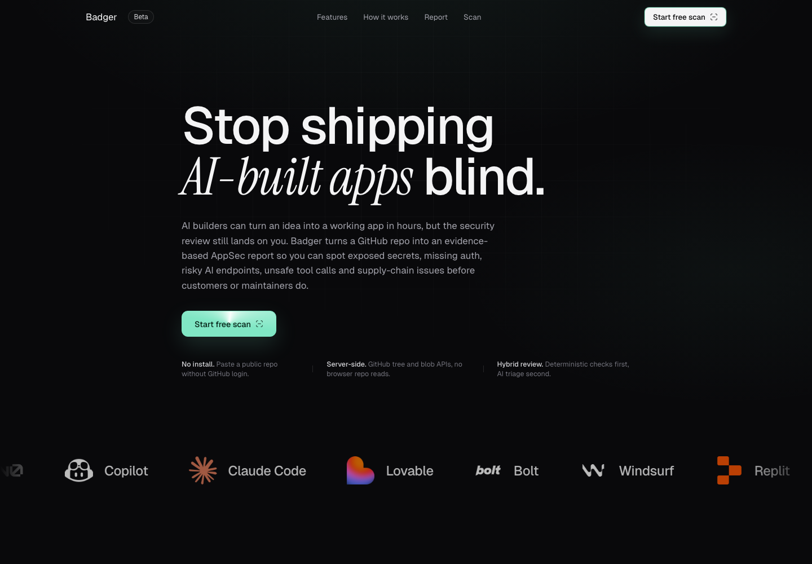
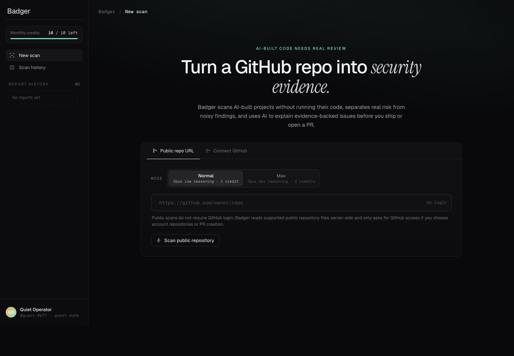

# Badger

**Badger is a GitHub-native AppSec copilot for AI-built web applications.** It scans repositories server-side, prioritizes high-signal security findings, and helps teams turn validated evidence into review-ready remediation work.

Built for the **Zero to Action Hackathon by Berset**.

Production demo: [https://badger-security.vercel.app](https://badger-security.vercel.app)

<p align="center">
  
</p>

## Why It Exists

AI-assisted builders can ship fast, but speed often hides security gaps: leaked secrets, unsafe Server Actions, missing auth checks, unbounded AI endpoints, weak Supabase RLS, risky GitHub Actions workflows, and dependency exposure.

Badger is designed for that workflow. It keeps the scan static and bounded, avoids executing untrusted repository code, and combines deterministic analysis with AI triage only after evidence has been collected and redacted.

## What It Does

- Scans public GitHub repositories by URL without requiring GitHub login.
- Supports GitHub login only for account repository selection, private repositories, and remediation PRs.
- Supports a server-side Badger GitHub App or read-only server token for public repository reads.
- Builds a repository inventory of routes, Server Actions, client components, imports, env reads, dangerous sinks, AI calls, database calls, Supabase migrations, manifests, lockfiles, and GitHub Actions workflows.
- Runs deterministic analyzers for secrets, access control gaps, unsafe AI/tool surfaces, dependency intelligence, Supabase posture, GitHub Actions supply-chain posture, and static code risk.
- Uses bounded taint-style traces for selected source-to-sink paths.
- Queries OSV by API for dependency intelligence without installing project dependencies.
- Uses AI review as a second-stage reviewer for explanation, prioritization, PR safety checks, and conservative patch planning.
- Exports SARIF and GitHub issue bodies.
- Tracks baselines so repeated scans can separate new, existing, resolved, and suppressed findings.

## Product Views

<p align="center">
  
</p>

## Scan Modes

| Mode | Purpose | Cost |
| --- | --- | --- |
| `Normal` | Recommended default for strong signal and practical runtime. | 1 credit |
| `Max` | Deeper AppSec review with broader repository context and stricter Claude reasoning. | 2 credits |
| `Generate fixes` | Creates a remediation text draft for selected findings. | 1 credit |

All modes keep the same safety boundary: Badger reads supported text files through GitHub APIs and never executes repository code.

## Security Model

Badger is intentionally conservative:

- Public repository scans do not require user GitHub authorization.
- No repository code execution.
- No `npm install`, package scripts, test runs, or build steps inside scanned repositories.
- No ZIP upload ingestion.
- GitHub OAuth tokens are handled server-side and stored only in encrypted `HttpOnly` cookies.
- API responses redact secrets and expose only public-safe report data.
- Reports are bound to a salted request identity.
- Production requires persistent Supabase storage and quota when `BADGER_REQUIRE_PERSISTENT_STORAGE=true` and `BADGER_REQUIRE_PERSISTENT_QUOTA=true`.
- Supabase tables use service-role access from route handlers; client roles are denied direct table reads.
- Private repository snippets are not sent to external AI providers unless explicitly enabled with `BADGER_ALLOW_PRIVATE_AI_REVIEW=true`.
- PR generation is gated by selected findings and, when an AI provider is configured, an AI safety review. High-risk app logic remains review-required instead of being blindly patched.

## Architecture

```txt
GitHub API extraction
  -> repository inventory
  -> deterministic analyzers
  -> OSV dependency intelligence
  -> bounded taint/evidence traces
  -> report policy, suppressions, baseline
  -> AI triage over redacted artifacts
  -> SARIF, issue body, PR workflow
```

Core routes:

| Route | Purpose |
| --- | --- |
| `/scan` | Start a public URL or GitHub-authenticated scan. |
| `/scans` | Scan history for the current identity. |
| `/report/[scanId]` | Detailed report view. |
| `/api/scan` | Create or run a scan. |
| `/api/scan/[scanId]` | Fetch a report for the owning identity. |
| `/api/scan/[scanId]/explain` | Generate bounded AI explanations and patch previews. |
| `/api/scan/[scanId]/pull-request` | Create a selected-scope remediation PR. |
| `/api/scan/[scanId]/sarif` | Export SARIF 2.1.0. |
| `/api/scan/[scanId]/baseline` | Save the current scan as the repo baseline. |
| `/api/scan/jobs/drain` | Protected worker endpoint for queued jobs. |
| `/api/system/health` | Secret-free production health status. |

## Production Requirements

Required server-side environment variables:

```bash
SUPABASE_URL=
SUPABASE_SERVICE_ROLE_KEY=
BADGER_IDENTITY_SALT=
BADGER_REQUIRE_PERSISTENT_STORAGE=true
BADGER_REQUIRE_PERSISTENT_QUOTA=true
BADGER_REQUIRE_DISTRIBUTED_BURST_LIMIT=true
BADGER_MONTHLY_SCAN_QUOTA=10
BADGER_GITHUB_SESSION_SECRET=
BADGER_WORKER_SECRET=
```

For public repository scans without user login, use a GitHub App installation with read-only repository access:

```bash
BADGER_GITHUB_APP_ID=
BADGER_GITHUB_APP_INSTALLATION_ID=
BADGER_GITHUB_APP_PRIVATE_KEY=
```

Badger intentionally ignores personal `BADGER_GITHUB_TOKEN` values in production. Local development can still use one to avoid anonymous GitHub API limits.

For optional GitHub login and PR creation:

```bash
GITHUB_CLIENT_ID=
GITHUB_CLIENT_SECRET=
GITHUB_REDIRECT_URI=https://your-domain.com/api/auth/github/callback
```

GitHub OAuth starts with read-only profile scopes. The broader `public_repo` scope is requested only when a user explicitly creates a pull request.

Public Supabase client variables:

```bash
NEXT_PUBLIC_SUPABASE_URL=
NEXT_PUBLIC_SUPABASE_ANON_KEY=
```

AI provider configuration:

```bash
BADGER_AI_PROVIDER=anthropic
ANTHROPIC_API_KEY=
BADGER_ANTHROPIC_MODEL=claude-opus-4-7
```

Other supported providers include Vercel AI Gateway and DeepSeek. If no provider is configured, scans still run and explanations fall back to deterministic remediation guidance.

## Supabase Setup

Run the migrations in order:

```txt
supabase/migrations/*.sql
```

The production schema stores scan reports, durable quota usage, queued jobs, baselines, and scan events. Direct reads from `anon` and `authenticated` are revoked; application access goes through trusted Next.js route handlers using the service role key.

## Local Development

```bash
pnpm install
pnpm run dev
```

Open [http://localhost:3000](http://localhost:3000).

Local development can use the git-ignored `.badger/scan-reports.json` file store. For repeated public GitHub scans, set `BADGER_GITHUB_TOKEN` in `.env.local` to avoid anonymous GitHub API limits. Production public scans should use the GitHub App path above instead of a personal token.

## Verification

Before production deployment:

```bash
pnpm run release:verify
```

The release verifier runs:

```bash
pnpm run scanner:smoke
pnpm exec tsc --noEmit --incremental false
pnpm run lint
pnpm run build
git diff --check
pnpm run prod:check
pnpm run supabase:verify
pnpm run vercel:verify
```

`prod:check`, `supabase:verify`, and `vercel:verify` are designed to fail closed when production storage, quota, OAuth, identity salt, PR safety review, Supabase connectivity, or Vercel env wiring are missing.

## Built With

- Next.js 16
- React 19
- TypeScript
- Supabase
- Vercel
- v0
- OSV
- Claude/Anthropic, Vercel AI Gateway, or DeepSeek for optional AI review

## v0 Project

This repository is linked to a v0 project. Future UI iterations can be continued from:

[Continue working on v0](https://v0.app/chat/projects/prj_UyIIlNd2ZthT22b4XM6lJrPfxEvc)
